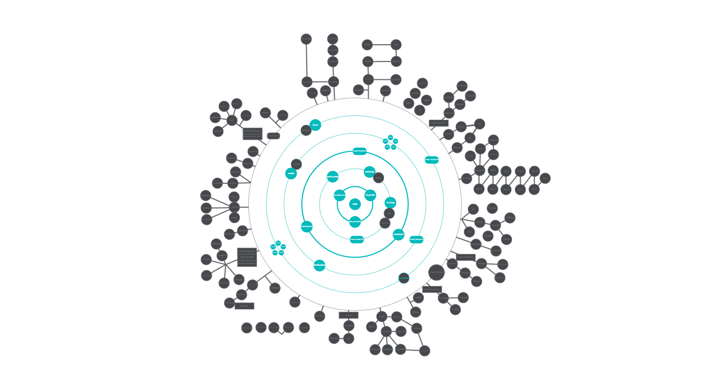

<h1 align="center">42cursus</h1>

  <b><i>Projects developed at <a href="https://www.42sp.org.br/">42 São Paulo</a> and <a href="https://42london.com/">42 London</a> programming schools.</i></b> 
  Start: Oct/2023 - the first 42 class of London!  
  End: -

<h2>About 42</h2>

42 is a global network of innovative programming schools with a project-based and peer-to-peer learning model, offering free education with no teachers, no formal classes, and no prior degree requirements. Students learn through collaboration, solving real-world problems, and developing both technical and soft skills while advancing at their own pace. Founded in Paris in 2013, 42 has expanded worldwide and continues to grow as one of the most disruptive educational models in software engineering. The network is currently led by CEO <b>Sophie Viger</b>, who has been a driving force in making the program more inclusive and accessible to people from diverse backgrounds.

   
  

<h2>Skills developed at 42</h2>

<h3>Hard Skills</h3>

C • C++ • Makefile • Shell scripting • Git • SQL • Networks • Docker • Computer Graphics

<h3>Soft Skills</h3>

  <b>Self-learning & Proactivity:</b> At 42, students take ownership of their learning. With no teachers or formal classes, you develop the ability to research independently, learn from peers, and adapt quickly to new challenges. 
  <b>Collaboration & Teamwork:</b> Many projects are designed for group work, encouraging effective communication, balancing different skill levels, and contributing collectively to achieve goals. 
  <b>Time Management & Resilience:</b> With a 24/7 open campus and demanding projects, students learn to prioritize tasks, manage deadlines, and persist through challenging workloads. 
  <b>Problem-Solving & Critical Thinking:</b> The project-based approach encourages creative thinking, debugging, and developing efficient solutions to complex real-world problems.

<h2>Curriculum</h2>

42cursus comprises two groups of projects: the <i>inner circle</i> (basic curriculum) and the <i>outer treks</i> (specialization projects). The inner circle covers all mandatory projects to reach level 7, while the outer treks allow specialization in various topics.

  

<table align="center">
  <thead>
    <tr>
      <th>CIRCLE</th>
      <th>PROJECT</th>
      <th>TECHNOLOGIES</th>
      <th>SKILLS LEARNED</th>
    </tr>
  </thead>
  <tbody>
    <tr>
      <td>00</td>
      <td><a href="https://github.com/sabrinafn/42_libft">Libft</a></td>
      <td>C</td>
      <td>Basic C, pointers, memory management, linked lists, modular coding</td>
    </tr>
    <tr>
      <td>01</td>
      <td><a href="https://github.com/sabrinafn/42_get_next_line">get_next_line</a></td>
      <td>C</td>
      <td>File I/O, buffer handling, reading from streams, defensive coding</td>
    </tr>
    <tr>
      <td>01</td>
      <td><a href="https://github.com/sabrinafn/42_ft_printf">ft_printf</a></td>
      <td>C</td>
      <td>Formatted output, variadic functions, string manipulation</td>
    </tr>
    <tr>
      <td>02</td>
      <td><a href="https://github.com/sabrinafn/42_push_swap">push_swap</a></td>
      <td>C</td>
      <td>Algorithm design, sorting strategies, stack manipulation, optimization</td>
    </tr>
    <tr>
      <td>02</td>
      <td><a href="https://github.com/sabrinafn/42_minitalk">minitalk</a></td>
      <td>C, Unix signals</td>
      <td>Client-server communication, signals, concurrency, low-level IPC</td>
    </tr>
    <tr>
      <td>02</td>
      <td><a href="https://github.com/sabrinafn/42_so_long">So Long</a></td>
      <td>C, MiniLibX, Game Logic</td>
      <td>2D game logic, graphics rendering, input handling, event loops</td>
    </tr>
    <tr>
      <td>03</td>
      <td><a href="https://github.com/sabrinafn/42_minishelll">Minishell</a></td>
      <td>C, Unix Shell, Pipes, Redirections</td>
      <td>Command parsing, process management, environment handling, shell scripting</td>
    </tr>
    <tr>
      <td>03</td>
      <td><a href="https://github.com/sabrinafn/42_philo">Philosophers</a></td>
      <td>C, Threads, Mutex, Concurrency</td>
      <td>Concurrency, thread synchronization, deadlock prevention, mutex usage</td>
    </tr>
    <tr>
      <td>04</td>
      <td><a href="https://github.com/sabrinafn/42_cub3D">Cub3D</a></td>
      <td>C, Raycasting, MiniLibX, Graphics</td>
      <td>Raycasting math, first-person rendering, texture mapping, keyboard controls</td>
    </tr>
    <tr>
      <td>04/05</td>
      <td><a href="https://github.com/sabrinafn/42_CPP">CPP Modules</a></td>
      <td>C++</td>
      <td>OOP, classes, inheritance, polymorphism, encapsulation</td>
    </tr>
    <tr>
      <td>05</td>
      <td><a href="https://github.com/sabrinafn/42_ft_irc">ft_irc</a></td>
      <td>C++, Sockets, Network</td>
      <td>Network programming, client-server architecture, message parsing</td>
    </tr>
    <tr>
      <td>05</td>
      <td><a href="https://github.com/sabrinafn/42_inception">Inception</a></td>
      <td>Docker, Web, SQL</td>
      <td>Containerization, multi-service deployment, databases, web servers</td>
    </tr>
  </tbody>
</table>
